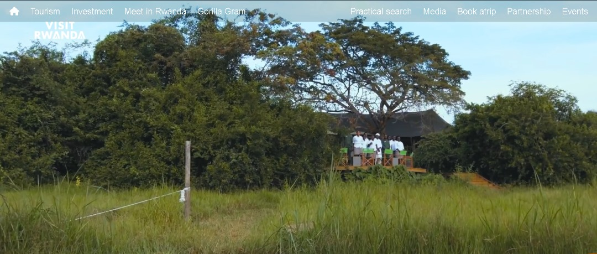

# Visit Rwanda  Clone With HTML and **CSS**
This project demonstrates a clone of visit Rwanda Website done with Pure HTML and CSS,JS this repository Purpose and people who are interested in frontend development and its easy to understand
the codes used.

## Author
## NDIZEYE LESLY

**LANDING PAGE VIEW ONE**

 
**Landing Page View Two**

**Landing Page View Three**

## Usage
### Steps
 1. Clone Repository 

        git clone 
        https://github.com/Leslyndizeye/motobike_html_and_css.git

2. Step two 
    
        cd visit_rwanda_clone_with_html_css

3. step three

        open index.html in your browser
        
## License
        [MIT LICENSE] (README.md)

Feel Free to use this software and exploral it communicate for 
# Contact Me!!
        Email: l@ndizeye@alustudent.com
        Phone: +250782540966
## Happy Hacking !!

